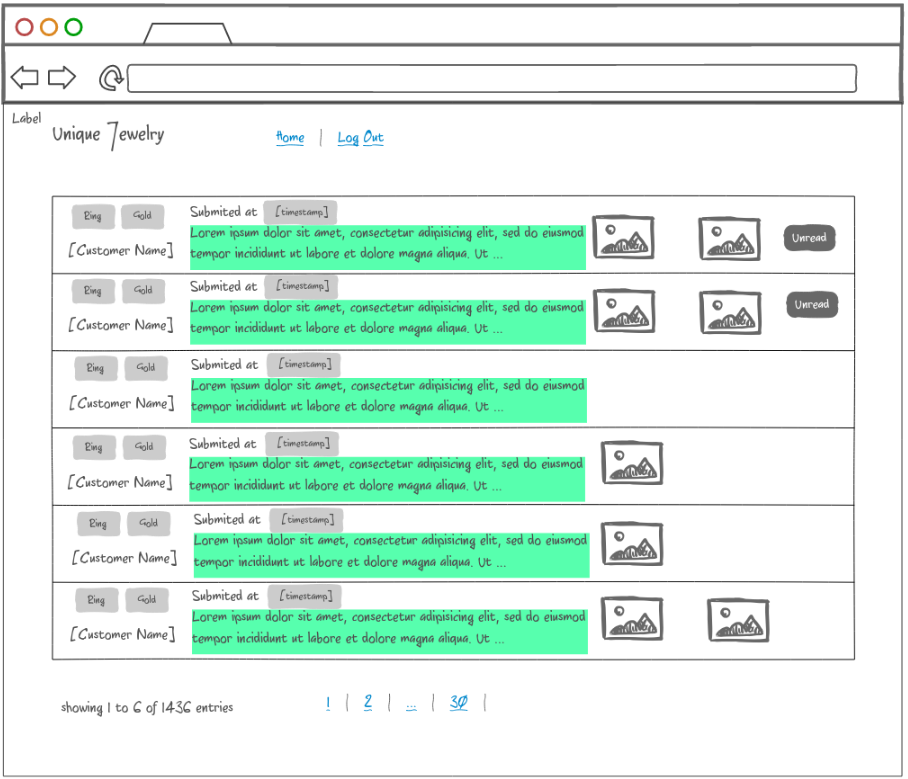
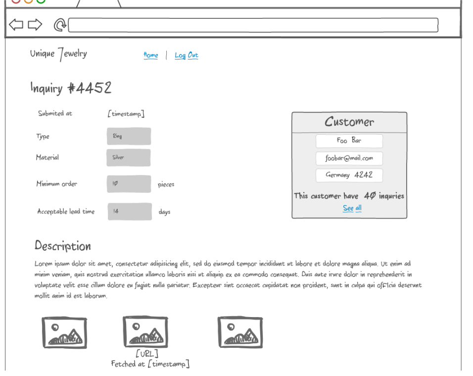

# 1 Welcome!

This document is the specification sheet for your work sample.

The application you have to create is a simple product inquiry web.

Where a customer can make an inquiry regarding a customized design of jewelry.

Therefore, you have to take in account the following points:

* You can only use the stable version Laravel or Lumen framework
* The well integration of testing is explicitly desired
* Strive for good code coverage
* You may use any library
* Quality over quantity

If you have questions, do not hesitate to ask us.

# 2 Backend

Save all the data in the MySQL database or SQLite.

Use background processing for a complex or long-running request.

You have to create the relational data model by yourself with regard to the requirements.

Take care of a structured naming.

Cache wisely!

*Bonus point for well implemented design pattern.*

# 3 Frontend

Strive to create a testable frontend.

*Bonus point for implementing SPA*

## 3.1 Inquiry page

The root page of the page is the inquiry page.

* A customer can submit an inquiry right away without have to log in

* Take care of abusive user, every unique IP address only allowed to submit data once every 10 seconds.
Implement a mechanism to prevent this on server side

* User can attach a reference to their design, it could be an image or link to a website

* If the inquiry contains a reference to a website, that website will be fetched by our system and save as an image.  We only scrape a well formed html and web scraping happen on server side.
Don't forget to store the web scraping metadata!

## 3.2 Email notification to customer

* After an inquiry submitted, an email notification send to customer contains a link to 
a page where they can view their inquiry.

* We don't want to leak our data to the world, so instead of giving out the inquiry identifier use a unique token associated to that inquiry and only valid for 1 month.

## 3.3 View inquiry as customer

*Bonus point for implementing personalized recommendation*

## 3.4 Email notification to admin

## 3.4 Login

This page only intended for admin to access all submitted data.

* After after logging in, user will be directed to their intended page or home.

## 3.5 List of inquiries

After logging in, all submitted inquiries will be shown in a table pagination.

* When a new inquiry submitted, it will be pushed to the table right away, so admin don't have to refresh the page.

* The most recent inquiry will be shown first

* Cut description content to 20 words and postfix with '...'

* A click on the row will redirect to the detail view

* Six inquiries are shown per page and sorted by date

* You can switch pagination by clicking on the links below the list

## 3.6 Inquiry detail

That image will be shown at inquiry detail.

* Get a list of all inquiries from a customer by clicking `See all` link.

* A click on a reference image will show a pop up with that image inside.

